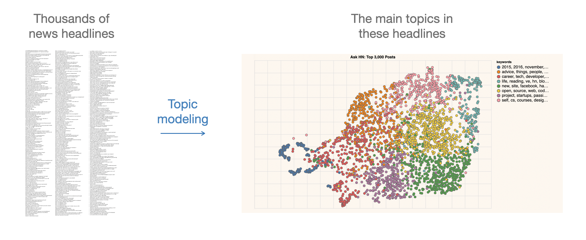
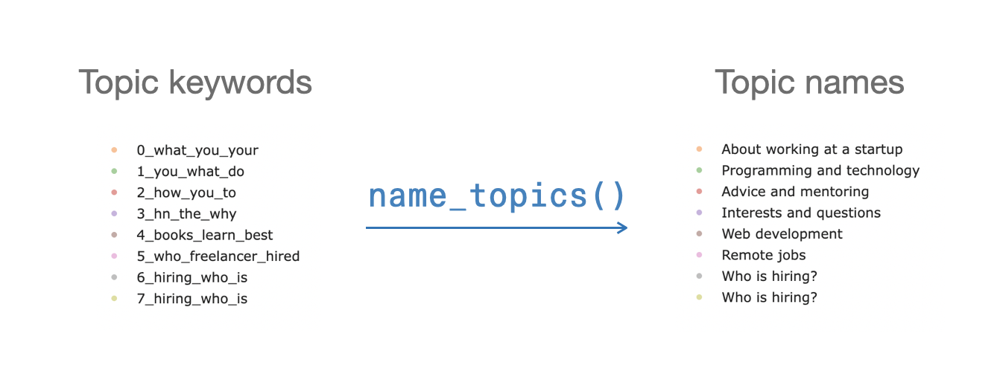
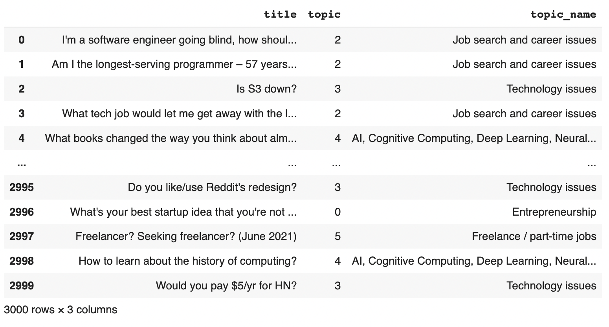

```
################################################################################
#    ____      _                     ____                  _ _                 #
#   / ___|___ | |__   ___ _ __ ___  / ___|  __ _ _ __   __| | |__   _____  __  #
#  | |   / _ \| '_ \ / _ \ '__/ _ \ \___ \ / _` | '_ \ / _` | '_ \ / _ \ \/ /  #
#  | |__| (_) | | | |  __/ | |  __/  ___) | (_| | | | | (_| | |_) | (_) >  <   #
#   \____\___/|_| |_|\___|_|  \___| |____/ \__,_|_| |_|\__,_|_.__/ \___/_/\_\  #
#                                                                              #
# This project is part of Cohere Sandbox, Cohere's Experimental Open Source    #
# offering. This project provides a library, tooling, or demo making use of    #
# the Cohere Platform. You should expect (self-)documented, high quality code  #
# but be warned that this is EXPERIMENTAL. Therefore, also expect rough edges, #
# non-backwards compatible changes, or potential changes in functionality as   #
# the library, tool, or demo evolves. Please consider referencing a specific   #
# git commit or version if depending upon the project in any mission-critical  #
# code as part of your own projects.                                           #
#                                                                              #
# Please don't hesitate to raise issues or submit pull requests, and thanks    #
# for checking out this project!                                               #
#                                                                              #
################################################################################
```

**Maintainer:** [jalammar](https://github.com/jalammar) \
**Project maintained until at least:** 2023-04-30

# A picture is worth a thousand sentences


When you want to explore thousands or millions of texts (messages, emails, news headlines), topic modeling tools help you make sense of them rapidly and visually.

# Topically

Topically is a \[work-in-progress\] suite of tools that help make sense of text collections (messages, articles, emails, news headlines) using large language models.

Topically's first feature is to name clusters of short texts based on their content. For example, here are news headlines from the machinelearning and investing subreddits, and the names suggested for them by topically:


# Usage Example
Use Topically to name clusters in the course of topic modeling

```python
import topically

app = topically.Topically('cohere_api_key')

example_texts = [
# Three headlines from the machine learning subreddit
"[Project] From books to presentations in 10s with AR + ML",
"[D] A Demo from 1993 of 32-year-old Yann LeCun showing off the World's first Convolutional Network for Text Recognition",
"[R] First Order Motion Model applied to animate paintings",

# Three headlines from the investing subreddit
"Robinhood and other brokers literally blocking purchase of $GME, $NOK, $BB, $AMC; allow sells",
"United Airlines stock down over 5% premarket trading",
"Bitcoin was nearly $20,000 a year ago today"]

# We know the first three texts belong to one topic (topic 0), the last three belong to another topic (topic 1)
example_topics = [0, 0, 0, 1, 1, 1]

topic_names = app.name_topics((example_texts, example_topics)) #Optional:  num_generations=5
topic_names # Run again to get new suggested names. More text examples should result in better names.

```

Output:
```
['Text recognition',
 'Text recognition',
 'Text recognition',
 'Stock Market Closing Bell',
 'Stock Market Closing Bell',
 'Stock Market Closing Bell']
 ```
 
In this simple example, we know the cluster assignments. In actual applications, a topic modeling library like BERTopic can cluster the texts for us, and then we can name them with topically. 

# Usage Example: Topically + BERTopic
Use Topically to name clusters in the course of topic modeling with tools like BERTopic. Get the cluster assignments from BERTopic, and name the clusters with topically. This improves on the keyword topic labels (and can build upon them).





Here's example code and a colab notebook demonstrating this.

<a href="https://colab.research.google.com/github/cohere-ai/sandbox-topically/blob/main/notebooks/Intro%20-%20Topically%20with%20BERTopic.ipynb" target="_parent\"></a>

Code excerpt:

```python

from bertopic import BERTopic
from topically import Topically

# Load and initialize BERTopic to use KMeans clustering with 8 clusters only.
cluster_model = KMeans(n_clusters=8)
topic_model = BERTopic(hdbscan_model=cluster_model)

# df is a dataframe. df['title'] is the column of text we're modeling
df['topic'], probabilities = topic_model.fit_transform(df['title'], embeds)

# Load topically
app = Topically('cohere_api_key')

# name clusters
df['topic_name'], topic_names = app.name_topics((df['title'], df['topic']))

df[['title', 'topic', 'topic_name']]
```




# Installation

You can install topically from pypi:

`pip install topically`

Optionally, you can also install topically with BERTopic:

`pip install topically[bertopic]`


# How it works

Topically uses a generative language model (GPT) to assign a name to the text cluster. It sends a request to Cohere's managed model (get an [API key](https://dashboard.cohere.ai/welcome/register?utm_source=github&utm_medium=content&utm_campaign=sandbox&utm_content=topically) and use it for free for prototyping).

To generate the titles, topically uses a couple of bundled prompts. To get the best names for your use case, it's best to edit the prompt to add more information about the context, and add good cluster names for 3-5 of your clusters.

This works best on short texts (given the context length limitations of GPT models). If you're working with long texts, you may experiment with excerpts or summaries of the texts.

# Architecture Overview
Topically is pretty simple and early in its life. At the moment, it's made up of two main class:

### `Topically`
This class maintains the client to the Cohere platform, and exposes the main interaction point with Topically (name_topics, at the moment). It lives in app.py.

### `ClusterNamer`
This class deals with preparing the prompts and calling the Generate endpoint to generate suggested topic names. It lives in cluster_namers.py.

# Get support
If you have any questions or comments, please file an issue or reach out to us on [Discord](https://discord.gg/co-mmunity).

# Contributors
If you would like to contribute to this project, please read `CONTRIBUTORS.md`
in this repository, and sign the Contributor License Agreement before submitting
any pull requests. A link to sign the Cohere CLA will be generated the first time 
you make a pull request to a Cohere repository.

# License
Topically has an MIT license, as found in the LICENSE file.
