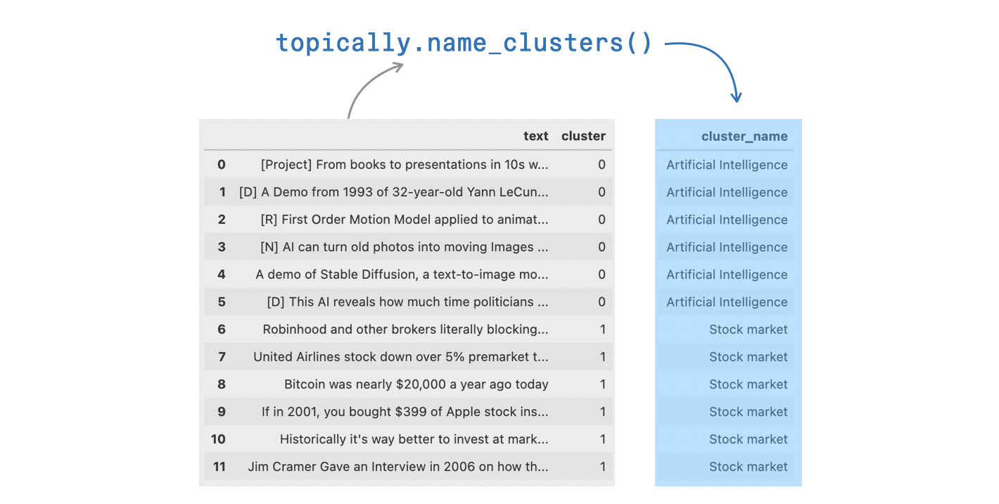

```
################################################################################
#    ____      _                     ____                  _ _                 #
#   / ___|___ | |__   ___ _ __ ___  / ___|  __ _ _ __   __| | |__   _____  __  #
#  | |   / _ \| '_ \ / _ \ '__/ _ \ \___ \ / _` | '_ \ / _` | '_ \ / _ \ \/ /  #
#  | |__| (_) | | | |  __/ | |  __/  ___) | (_| | | | | (_| | |_) | (_) >  <   #
#   \____\___/|_| |_|\___|_|  \___| |____/ \__,_|_| |_|\__,_|_.__/ \___/_/\_\  #
#                                                                              #
# This project is part of Cohere Sandbox, Cohere's Experimental Open Source    #
# offering. This project provides a library, tooling, or demo making use of    #
# the Cohere Platform. You should expect (self-)documented, high quality code  #
# but be warned that this is EXPERIMENTAL. Therefore, also expect rough edges, #
# non-backwards compatible changes, or potential changes in functionality as   #
# the library, tool, or demo evolves. Please consider referencing a specific   #
# git commit or version if depending upon the project in any mission-critical  #
# code as part of your own projects.                                           #
#                                                                              #
# Please don't hesitate to raise issues or submit pull requests, and thanks    #
# for checking out this project!                                               #
#                                                                              #
################################################################################
```

**Maintainer:** [jalammar](https://github.com/jalammar) \
**Project maintained until at least:** 2023-04-30

# Topically

Topically is a suite of tools that help make sense of text collections (messages, articles, emails, news headlines) using large language models.


Topically's first feature is to name clusters of texts based on their content. For example, here are news headlines from the machinelearning and investing subreddits, and the names suggested for them by topically:




# Usage Example: Topically + BERTopic
Use Topically to name clusters in the course of topic modeling with tools like BERTopic. Get the cluster assignments from BERTopic, and name the clusters with topically.

# Installation

`pip install topically`

Optionally, you can also install topically with BERTopic:

`pip install topically[bertopic]`

# Get support
If you have any questions or comments, please file an issue or reach out to us on [Discord](https://discord.gg/co-mmunity).

# Contributors
If you would like to contribute to this project, please read `CONTRIBUTORS.md`
in this repository, and sign the Contributor License Agreement before submitting
any pull requests. A link to sign the Cohere CLA will be generated the first time 
you make a pull request to a Cohere repository.

# License
Topically has an MIT license, as found in the LICENSE file.
